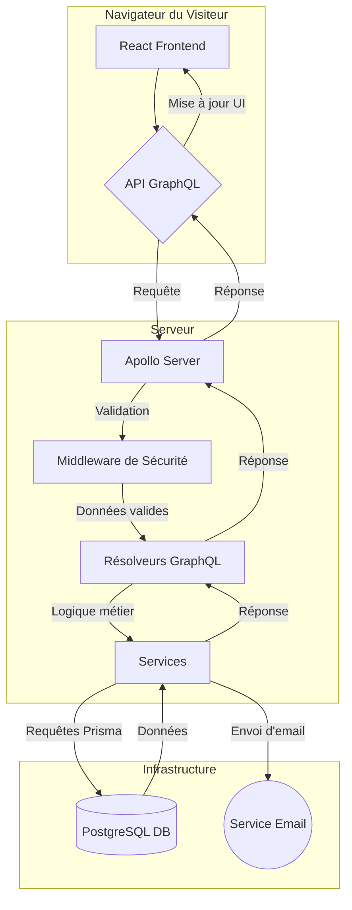

# 📄 Documentation du Projet : NetPub

---

*Ce document a été généré pour fournir une vue d'ensemble complète de l'application NetPub, de son architecture et des tâches réalisées. Il est conçu pour être facilement partageable et peut être exporté en HTML ou PDF pour une meilleure visualisation.*

---

## 🧭 Sommaire

1.  [Introduction](#-introduction)
2.  [🚀 Fonctionnalités Principales](#-fonctionnalités-principales)
3.  [✅ Tâches Réalisées](#-tâches-réalisées)
4.  [📚 APIs et Bibliothèques Utilisées](#-apis-et-bibliothèques-utilisées)
5.  [🏗️ Structure du Code](#️-structure-du-code)
6.  [📊 Diagramme de l'Application](#-diagramme-de-lapplication)
7.  [📜 Historique des Modifications](#-historique-des-modifications)
8.  [🤝 Collaboration et Mises à Jour](#-collaboration-et-mises-à-jour)

---

## 🎯 Introduction

Le projet **NetPub** est une plateforme web moderne conçue pour une agence de création de contenu vidéo. Son objectif principal est de présenter le portfolio de l'agence, d'attirer de nouveaux clients et de gérer les interactions via un tableau de bord intégré.

L'application combine un frontend dynamique et esthétique en **React** avec un backend robuste en **Node.js** utilisant **GraphQL** pour des communications de données efficaces.

---

## 🚀 Fonctionnalités Principales

- [x] **Portfolio Visuel :** Affichage des projets vidéo sous forme de grille maçonnée (`Masonry`) et de flux.
- [x] **Pages de Contenu :** Pages dédiées pour les services, le contact, et la présentation de l'agence.
- [x] **Interactions Utilisateur :** Système de "likes" et de commentaires anonymes sur les projets.
- [x] **Formulaire de Contact :** Formulaire sécurisé avec envoi d'emails de notification et d'auto-réponse.
- [x] **Chatbot :** Assistant virtuel pour guider les utilisateurs (logique non détaillée ici).
- [x] **Dashboard de Gestion :**
    - [x] Vue d'ensemble des statistiques (conversations, commandes, etc.).
    - [x] Gestion des conversations du chatbot.
    - [x] Suivi des commandes et des rendez-vous avec pagination et filtres.
    - [x] Page d'analyse des performances du chatbot.
- [x] **Authentification :** Système de connexion pour l'accès au dashboard.

---

## ✅ Tâches Réalisées

Cette section liste les améliorations et corrections apportées au projet.

- [x] **Refonte du Dashboard :**
    - [x] Dynamisation complète des données des pages `Overview`, `Analytics`, `Orders`, et `Appointments`.
    - [x] Remplacement de toutes les données statiques (`mockData`) par des appels à l'API GraphQL.
    - [x] Implémentation de la pagination et du filtrage côté serveur pour les listes de commandes et de rendez-vous.
- [x] **Fiabilisation du Backend :**
    - [x] Correction de multiples erreurs de build et de syntaxe.
    - [x] Résolution des conflits de dépendances (`graphql` module duplication).
    - [x] Centralisation de la gestion des dépendances dans le `package.json` racine.
- [x] **Sécurisation de l'API :**
    - [x] **Validation des Entrées (Anti-Erreurs 400) :** Implémentation d'un middleware de validation avec `zod` pour toutes les mutations sensibles, rejetant les requêtes invalides avec des erreurs claires.
    - [x] **Protection XSS :** Nettoyage systématique des entrées utilisateur avec `dompurify` pour prévenir les injections de scripts.
    - [x] **Protection Force Brute :** Mise en place d'un limiteur de débit (`express-rate-limit`) sur l'API GraphQL pour prévenir les abus.
- [x] **Optimisation SEO & Performance :**
    - [x] **Chargement Paresseux (Lazy Loading) :**
        - [x] Ajout de `loading="lazy"` sur les images du portfolio.
        - [x] Implémentation de `React.lazy` et `Suspense` pour les composants lourds en bas de page.
    - [x] **Optimisation des Métadonnées :**
        - [x] Création d'un composant `<SEO>` réutilisable pour gérer les balises `title`, `description`, `keywords` et Open Graph.
        - [x] Déploiement de métadonnées optimisées sur les pages principales (Accueil, Services, Portfolio, Contact).

---

## 📚 APIs et Bibliothèques Utilisées

### Frontend

| Bibliothèque | Rôle | Documentation |
| :--- | :--- | :--- |
| **React 19** | Framework principal pour l'interface utilisateur. | [react.dev](https://react.dev/) |
| **Vite** | Outil de build et serveur de développement ultra-rapide. | [vitejs.dev](https://vitejs.dev/) |
| **TypeScript** | Sur-ensemble de JavaScript pour un typage statique. | [typescriptlang.org](https://www.typescriptlang.org/) |
| **React Router** | Gestion de la navigation et des routes de l'application. | [reactrouter.com](https://reactrouter.com/) |
| **React Lazy** | Chargement paresseux des composants pour la performance. | [react.dev/reference/react/lazy](https://react.dev/reference/react/lazy) |
| **React Icons** | Bibliothèque d'icônes populaires pour React. | [react-icons.github.io/react-icons/](https://react-icons.github.io/react-icons/) |
| **React Masonry CSS** | Composant React pour une mise en page en grille de type Masonry. | [github.com/paulcollett/react-masonry-css](https://github.com/paulcollett/react-masonry-css) |
| **GSAP** | Bibliothèque d'animation JavaScript professionnelle. | [greensock.com/gsap/](https://greensock.com/gsap/) |
| **React Swipeable** | Composant pour gérer les événements de balayage (swipe) sur React. | [github.com/FormidableLabs/react-swipeable](https://github.com/FormidableLabs/react-swipeable) |


### Backend

| Bibliothèque | Rôle | Documentation |
| :--- | :--- | :--- |
| **Node.js** | Environnement d'exécution JavaScript côté serveur. | [nodejs.org](https://nodejs.org/) |
| **Express** | Framework minimaliste pour le serveur web. | [expressjs.com](https://expressjs.com/) |
| **Apollo Server Express** | Serveur GraphQL pour Express. | [www.apollographql.com/docs/apollo-server/](https://www.apollographql.com/docs/apollo-server/) |
| **GraphQL** | Langage de requête pour l'API. | [graphql.org](https://graphql.org/) |
| **Prisma** | ORM pour l'interaction avec la base de données PostgreSQL. | [prisma.io](https://www.prisma.io/) |
| **Zod** | Validation de schémas pour les entrées de l'API. | [zod.dev](https://zod.dev/) |
| **DOMPurify** | Nettoyage du HTML pour la prévention des attaques XSS. | [github.com/cure53/DOMPurify](https://github.com/cure53/DOMPurify) |
| **Express Rate Limit**| Middleware pour limiter le débit des requêtes (protection force brute). | [github.com/express-rate-limit/express-rate-limit](https://github.com/express-rate-limit/express-rate-limit) |
| **Nodemailer** | Envoi d'emails pour le formulaire de contact. | [nodemailer.com](https://nodemailer.com/) |
| **Express Session** | Middleware de gestion des sessions pour Express. | [expressjs.com/en/resources/middleware/session.html](https://expressjs.com/en/resources/middleware/session.html) | 
| **Helmet** | Collection de middlewares pour sécuriser les en-têtes HTTP. | [helmetjs.github.io/](https://helmetjs.github.io/) |
| **CORS** | Middleware Express pour activer le Cross-Origin Resource Sharing. | [expressjs.com/en/resources/middleware/cors.html](https://expressjs.com/en/resources/middleware/cors.html) |
| **Dotenv** | Charge les variables d'environnement à partir d'un fichier .env. | [github.com/motdotla/dotenv](https://github.com/motdotla/dotenv) |
| **TSX** | Exécute TypeScript directement dans Node.js. | [github.com/esbuild-kit/tsx](https://github.com/esbuild-kit/tsx) |
| **Concurrently** | Exécute plusieurs commandes en parallèle. | [github.com/open-cli-tools/concurrently](https://github.com/open-cli-tools/concurrently) |
| **Bcryptjs** | Bibliothèque pour le hachage de mots de passe. | [github.com/dcodeIO/bcrypt.js](https://github.com/dcodeIO/bcrypt.js) |
| **Jsonwebtoken** | Implémentation de JSON Web Tokens pour l'authentification. | [github.com/auth0/node-jsonwebtoken](https://github.com/auth0/node-jsonwebtoken) |
| **JSDOM** | Implémentation de la spécification WHATWG DOM et HTML en Node.js. | [github.com/jsdom/jsdom](https://github.com/jsdom/jsdom) |
| **UUID** | Générateur d'UUID (identifiants uniques universels). | [github.com/uuidjs/uuid](https://github.com/uuidjs/uuid) |
| **@google/genai** | SDK Google Gemini pour l'intégration de l'IA générative. | [github.com/google/generative-ai-js](https://github.com/google/generative-ai-js) |

---

## ⚙️ Architecture Backend

Cette section détaille les principaux fichiers et modules du backend, leur rôle et leur interaction.

### Fichiers et Modules Principaux

*   **`backend/server.ts`**: C'est le point d'entrée principal de l'application backend. Il configure le serveur Express, intègre Apollo Server pour GraphQL, initialise les middlewares (CORS, Helmet, gestion de session, limiteur de débit), établit la connexion à la base de données via Prisma, et gère les erreurs globales. Il expose également un endpoint `/health` pour le monitoring et un endpoint `/csrf-token` (actuellement désactivé) pour la gestion des tokens CSRF.
*   **`backend/graphql/schema.ts`**: Ce fichier définit le schéma GraphQL de l'application. Il utilise la fonction `gql` d'Apollo Server pour spécifier les types de données (`User`, `Project`, `Comment`, `Like`, etc.), les requêtes (`Query`) et les mutations (`Mutation`) disponibles via l'API GraphQL. C'est le contrat entre le frontend et le backend pour les opérations de données.
*   **`backend/graphql/resolvers.ts`**: Ce fichier contient les résolveurs GraphQL, qui sont les fonctions exécutant la logique métier pour chaque requête et mutation définies dans le schéma. Ils interagissent avec la base de données via Prisma, utilisent des services pour des opérations spécifiques (authentification, envoi d'emails, gestion du tableau de bord) et incluent la désinfection des entrées utilisateur avec `DOMPurify`.

### Services (`backend/lib/`)

*   **`backend/lib/auth.ts`**: Ce service gère toutes les fonctionnalités liées à l'authentification et l'autorisation des utilisateurs. Il inclut le hachage des mots de passe (`bcryptjs`), la génération et la vérification des JSON Web Tokens (JWT), la création d'un utilisateur administrateur par défaut, l'authentification des utilisateurs avec protection contre les attaques par force brute (blocage d'IP), et l'enregistrement de nouveaux utilisateurs. Il interagit directement avec la base de données via Prisma pour les opérations sur les utilisateurs.
*   **`backend/lib/dashboard.ts`**: Ce service fournit des méthodes pour récupérer toutes les données et statistiques nécessaires aux différentes vues du tableau de bord (vue d'ensemble, analyses, rendez-vous, commandes, conversations). Il utilise Prisma pour interroger la base de données, effectue des agrégations statistiques, gère le filtrage et la pagination des données, et inclut des opérations CRUD pour la mise à jour des statuts, la suppression de conversations et l'ajout de notes.
*   **`backend/lib/email.ts`**: Ce service est responsable de l'envoi d'emails. Il utilise `nodemailer` pour configurer un transporteur SMTP (via les variables d'environnement) et fournit des méthodes pour envoyer des notifications de formulaire de contact à l'administrateur ainsi que des réponses automatiques aux utilisateurs. Il gère la construction des emails en formats HTML et texte brut et inclut la gestion des erreurs lors de l'envoi.

### Fichiers de Configuration et Utilitaires

*   **`backend/.env`**: Fichier de configuration des variables d'environnement (par exemple, `DATABASE_URL`, `SESSION_SECRET`).

Cette section décrit les principaux composants React utilisés dans l'application, leur rôle et leur emplacement.

### Composants Génériques (`components/`)

*   **`AnimatedHero.tsx`**: Composant d'en-tête animé, souvent utilisé sur la page d'accueil pour une introduction visuelle dynamique.
*   **`AppContent.tsx`**: Gère le contenu principal de l'application, incluant la logique de routage et l'affichage des pages.
*   **`BackgroundTrail.tsx`**: Crée un effet visuel de traînée en arrière-plan, ajoutant une touche esthétique.
*   **`CallToAction.tsx`**: Composant réutilisable pour afficher des appels à l'action, incitant les utilisateurs à interagir.
*   **`Chatbot.tsx`**: Implémente l'interface et la logique du chatbot interactif.
*   **`ClientMarquee.tsx`**: Affiche une bande défilante (marquee) de logos de clients ou de témoignages.
*   **`Comment.tsx`**: Représente un seul commentaire, affichant son contenu et l'auteur.
*   **`CommentThread.tsx`**: Gère l'affichage et l'ajout de commentaires pour un élément donné (par exemple, un projet).
*   **`DashboardHeader.tsx`**: L'en-tête spécifique aux pages du tableau de bord.
*   **`DashboardLayout.tsx`**: Définit la structure de mise en page des pages du tableau de bord, incluant la barre latérale et l'en-tête.
*   **`DashboardSidebar.tsx`**: La barre latérale de navigation pour le tableau de bord.
*   **`ElectricBorder.tsx`**: Composant visuel créant un effet de bordure "électrique" ou lumineux.
*   **`Footer.tsx`**: Le pied de page de l'application, contenant des liens de navigation et des informations légales.
*   **`Header.tsx`**: L'en-tête principal de l'application, incluant la navigation et le logo.
*   **`ImageTrail.tsx`**: Crée un effet visuel de traînée d'images lors du mouvement de la souris.
*   **`MasonryGrid.tsx`**: Composant pour afficher des éléments dans une grille de type Masonry (colonnes de hauteur variable).
*   **`ObliqueMasonryScroller.tsx`**: Un scroller avec un effet de grille Masonry oblique.
*   **`PillNavBar.tsx`**: Une barre de navigation stylisée avec des éléments en forme de pilule.
*   **`PortfolioCard.tsx`**: Représente une carte individuelle dans le portfolio, affichant un projet.
*   **`PricingPlans.tsx`**: Affiche les différentes options de plans tarifaires.
*   **`ProjectFeed.tsx`**: Gère l'affichage d'un flux de projets, souvent utilisé dans le portfolio.
*   **`ProjectFeedItem.tsx`**: Représente un élément individuel dans le flux de projets, avec des détails et des interactions (likes, commentaires).
*   **`ProtectedRoute.tsx`**: Composant de route qui protège l'accès aux pages nécessitant une authentification.
*   **`SEO.tsx`**: Composant pour gérer les balises SEO (titre, description, meta) de chaque page.
*   **`StatsSection.tsx`**: Affiche une section de statistiques ou de chiffres clés.
*   **`TestimonialCarousel.tsx`**: Un carrousel pour afficher des témoignages clients.
*   **`TestimonialsGrid.tsx`**: Affiche des témoignages clients sous forme de grille.
*   **`ThankYouModal.tsx`**: Une modale de remerciement, souvent affichée après la soumission d'un formulaire.
*   **`VideoModal.tsx`**: Une modale pour afficher des vidéos en plein écran.

### Pages (`pages/`)

*   **`About.tsx`**: La page "À propos" de l'agence.
*   **`Contact.tsx`**: La page de contact avec un formulaire et des informations.
*   **`Home.tsx`**: La page d'accueil de l'application.
*   **`LegalMentions.tsx`**: La page des mentions légales.
*   **`Login.tsx`**: La page de connexion pour les utilisateurs.
*   **`Portfolio.tsx`**: La page affichant le portfolio de projets.
*   **`PrivacyPolicy.tsx`**: La page de politique de confidentialité.
*   **`Services.tsx`**: La page présentant les services offerts par l'agence.
*   **`TermsOfService.tsx`**: La page des conditions d'utilisation.

---

## 🏗️ Structure du Code

L'application est structurée comme un monorepo avec une séparation claire entre le frontend et le backend.

```
/
├── backend/            # Contient toute la logique serveur
│   ├── graphql/        # Schéma et résolveurs GraphQL
│   ├── lib/            # Services (auth, email, dashboard) et connexion Prisma
│   └── prisma/         # Schéma de la BDD, migrations et seeds
│   └── server.ts       # Point d'entrée du serveur Express et Apollo
├── components/         # Composants React réutilisables (Header, Footer, Card, etc.)
├── pages/              # Composants React représentant les pages complètes
│   └── dashboard/      # Pages spécifiques au tableau de bord
├── contexts/           # Contextes React pour le partage d'état (Auth, Chatbot)
├── hooks/              # Hooks React personnalisés (ex: useOnScreen)
├── public/             # Fichiers statiques (images, vidéos, favicon)
├── App.tsx             # Composant racine avec le routeur
├── index.tsx           # Point d'entrée de l'application React
└── package.json        # Dépendances et scripts pour l'ensemble du projet
```

---

## 📊 Diagramme de l'Application

Ce diagramme illustre le flux de données et l'interaction entre les différentes parties de l'application.



---

## 📜 Historique des Modifications

Basé sur la session de travail actuelle, voici un résumé des changements majeurs :

1.  **Analyse et Planification :** Audit complet du projet, identification des données statiques dans le dashboard et des faiblesses potentielles de l'API.
2.  **Refonte du Backend du Dashboard :** Extension du schéma GraphQL et des services pour permettre un affichage dynamique et complet des données (analyses, commandes, rendez-vous).
3.  **Refonte du Frontend du Dashboard :** Remplacement des données statiques par des appels à la nouvelle API, ajout de la pagination et des filtres.
4.  **Fiabilisation et Sécurisation :**
    - Ajout de la validation des entrées (`zod`) pour prévenir les erreurs et les abus.
    - Ajout du nettoyage des données (`dompurify`) pour bloquer les attaques XSS.
    - Mise en place d'un limiteur de débit pour se protéger contre les attaques par force brute.
5.  **Optimisation SEO & Performance :**
    - Implémentation du chargement paresseux (lazy loading) pour les images et les composants.
    - Création et déploiement d'un système de gestion des méta-tags pour améliorer le référencement.
6.  **Débogage Itératif :** Correction de multiples erreurs de build (syntaxe, dépendances, configuration) en collaboration avec l'utilisateur.

---

## 🤝 Collaboration et Mises à Jour

Ce document Markdown est la première étape. Pour une collaboration efficace en équipe, il est recommandé de :

- **Versionner ce fichier :** Intégrez `DOCUMENTATION.md` à votre dépôt Git pour que chaque membre de l'équipe puisse le consulter et le mettre à jour.
- **Utiliser des Plateformes Collaboratives :** Pour des commentaires et des discussions en temps réel, vous pouvez héberger cette documentation sur des plateformes comme **GitHub**, **GitLab**, ou l'importer dans des outils comme **Notion** ou **Confluence**.
- **Automatiser la Documentation :** Pour les API, envisagez des outils comme [Swagger](https://swagger.io/) ou [Compodoc](https://compodoc.app/) qui peuvent générer de la documentation à partir de votre code.

